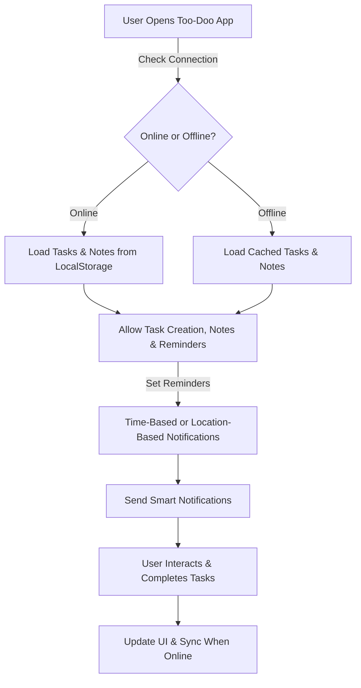

# Too-Doo_Website

Due to privacy reasons the source code have been hidden.

### 🔗 **Live Demo**
https://too-doo-app.vercel.app/ 🌎

# 📝 Too-Doo App

## 🚀 Overview
Welcome to **Too-Doo App** – a feature-packed, intuitive, and beautifully designed **Task & Notes Manager** 🗂️✨. With a **live body background 🌟, smart reminders ⏰📍, offline support 📶, haptic feedback 📳, and a digital clock ⏳**, this app helps you organize your life efficiently! Built with Progressive Web App (**PWA**) capabilities, it works seamlessly **offline & online**.

---

## 🏗️ Project Structure
The app consists of the following core files:

📂 **`index.html`** - Defines the structure of the app.  
🎨 **`styles.css`** - Controls layout, animations, and dark mode.  
📜 **`app.js`** - Manages tasks, notes, haptic feedback, reminders, and offline status.  
🛡️ **`sw.js`** - Enables PWA support with service workers.  
⚡ **`offline.html`** - Displays a fallback UI when offline.

---

## 🎯 Features & How It Works

### 🎨 **Live Body Background with Dynamic Particles**
- Experience an animated **background with floating particles** ✨⚡.
- Changes based on light or dark mode for a **soothing user experience**.

### ⏳ **Digital Clock & Live Date**
- A **real-time digital clock** is embedded in the navbar 🕰️.
- Displays **formatted date & time** and updates every second ⏱️.

### ✅ **Task Management with Smart Filters**
- **Add, Edit, Delete, and Mark tasks as completed** with ease 📝.
- **Filter by status**: `All`, `Active`, `Completed` 🔍.
- Auto-saves **tasks to LocalStorage** 💾.

### 🗒️ **Quick Notes**
- Capture thoughts and ideas instantly 📝⚡.
- Notes are saved automatically and persist after reloads 📌.

### 📳 **Haptic Feedback (Vibration Effect)**
- Provides a **subtle vibration effect** when clicking buttons 🎛️.
- Enhances user experience and feels more interactive 🤩.

### ⏰ **Smart Reminders – Time & Location-Based Notifications**
- ⏳ **Time-Based Reminders** – Receive notifications for upcoming tasks.
- 📍 **Location-Based Reminders** – Get notified when near a set location!
- Uses **Geolocation API** and **Notification API** to alert users 🚀.

### 📶 **Offline Mode & Service Worker Support**
- Detects online/offline status automatically 🌐.
- Caches essential files to allow app usage without an internet connection 💡.
- Displays a **custom offline page** (`offline.html`) when disconnected 🚧.

### 🎯 **Flowchart: App Workflow**

---

## 🛠️ How the Files Work Together
1️⃣ **`index.html`** 🏗️ – Provides the UI structure and connects to CSS & JS.  
2️⃣ **`styles.css`** 🎨 – Ensures a visually appealing design with animations & dark mode.  
3️⃣ **`app.js`** 🎯 – Handles tasks, notes, haptic feedback, reminders, and background effects.  
4️⃣ **`sw.js`** 🛡️ – Enables **PWA features** and caches files for offline use.  
5️⃣ **`offline.html`** 🚧 – Provides a smooth **offline experience**.

---

## 📥 Installation & Usage

### 🔗 **Live Demo**
https://too-doo-app.vercel.app/ 🌎

### 💻 **Run Locally**
### 📲 **Install as a Progressive Web App (PWA)**
1. Open the app in Chrome/Edge.
2. Click **Install** in the address bar 📌.
3. The app is now available offline in your applications list 📂.

---

## 🏆 Credits & Contact
Developed with ❤️ by **MD. NAYAJ MONDAL**  
📧 **Email**: [md.n.m.pius18@gmail.com](mailto:md.n.m.pius18@gmail.com)  
🔗 **LinkedIn**: [linkedin.com/in/md-nayaj-mondal](https://www.linkedin.com/in/md-nayaj-mondal)  

